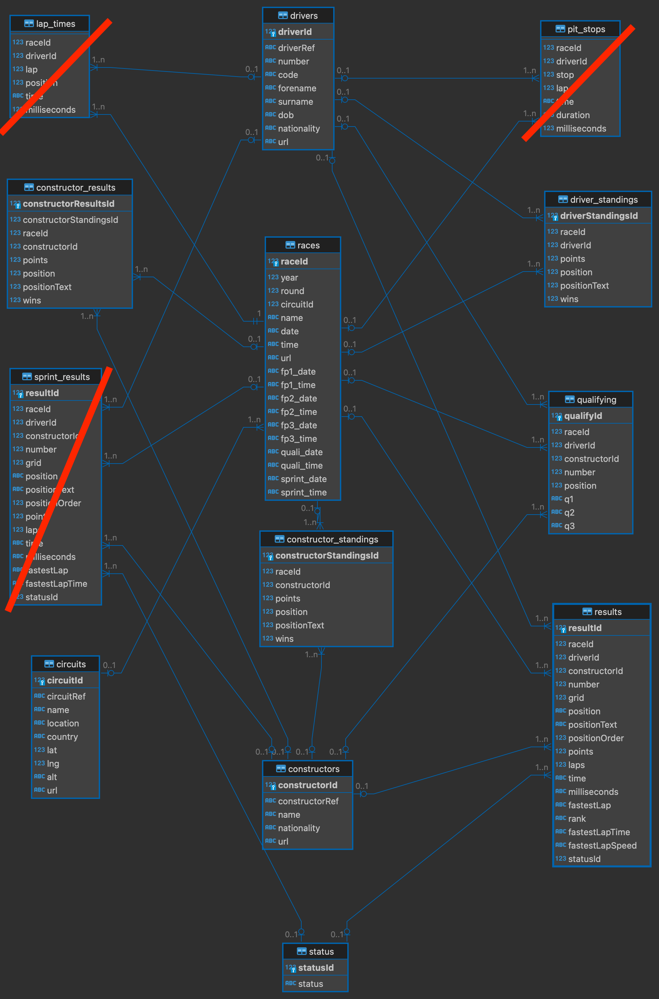
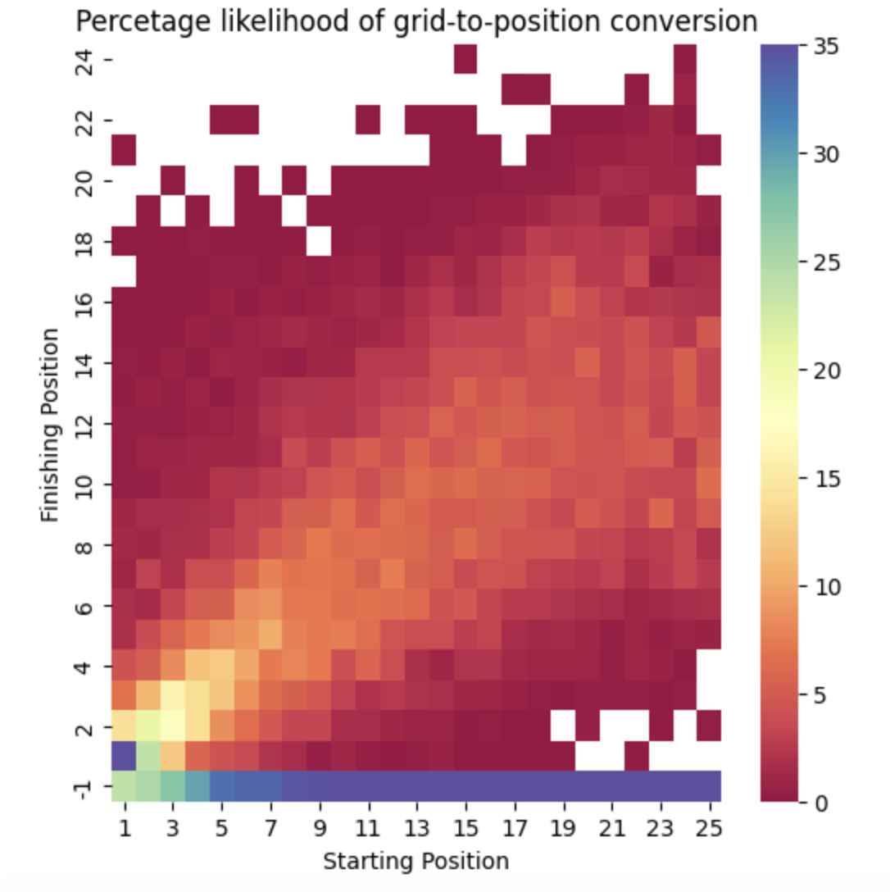

# F1 Model

**For personal educational purposes only**

---

## Problem Statement

With what sort of success and certainty levels can the F1 race results be predicted?
The prediction in the first instance will be made knowing the qualifying results. At the time of writing this there is no empiric or heuristic evidence that this should be better or easier. Gut feel and intuition say it ought to be easier?

## Approach To Understanding the Problem

This problem, while it will involve learning a bunch of new skills, will follow like any other project a systemic route. PACE framework learned in Google's data analytics program will be adopted. For more reference feel free to read a [good summary of PACE framework](https://medium.com/p/12206e1ea536).


### Plan

1. Data
    - The data should at first be fully inclusive from the beginning of F1 existence.
    - The data may later be trimmed or otherwise selectively discarded following EDA.
    - Data shall be acquired from an external source such as [Kaggle](https://www.kaggle.com/datasets/rohanrao/formula-1-world-championship-1950-2020)
    - Data shall be analysed and missing fields shall be filled in, and missing features should be added. E.g., it is known that weather information is missing. 
    - Data shall be stored on a relational database for ease of manipulation.
2. Stakeholder
    - I am mainly doing this for myself. I will be the accuser, the defendant, the jury and the judge in this court room :)
    - Not discarding the chance for a potential future employer or colleague to view this repository. Their holding stake in this project is the visibility and understanding of the process, as opposed to the final result.
3. Timeline
    - **No strict timelines**. Given some early investigatory work, I estimate **between 20 and 40h** of total work. Time depends on the extent of model building and results of EDA. My knowledge/ignorance permitting, project should aim to be as comprehensive as it takes to be of a great research standard.
4. Milestones
    - **Milestone for Planning Stage**: clear understanding of the problem at hand. Visibility into available data, and best choice of the dataset. Knowledge of data pitfalls and good understanding of what is needed to complete the dataset.
    - **Milestone for Analyse Stage**: Setup database (will require understanding the best solution to this, whether it is SQLite or PostgreSQL or any other)
    - **Milestone for Analyse Stage**: Clean and complete dataset
    - **Milestone for Analyse Stage**: EDA report highlighting key avenues of solving the problem
    - **Milestone for Construct Stage**: Good analysis of a few models along with results analysis from those ML models. This project is for me, need not be efficient in execution. 
    - **Milestone for Construct Stage**: Model comparison and final results report, optionally inclusive of a visualisation dashboard in Tableau
    - **Milestone for Execute Stage**: Make this repository public and link it to my CV

---

## Data

The used dataset will be taken from [Kaggle](https://www.kaggle.com/datasets/rohanrao/formula-1-world-championship-1950-2020). It consists of 14 interlinked CSV files, which screams to be put onto a relational database. But steady...

First - load each file and examine its contents. Check what columns they have, how are they interlinked, what data is missing, how complete is the dataset from 1950 to 2023. Check against other sources. Then complete and clean the dataset. Finally run some basic data description to further understand the data a little more.

### ER diagram of F1 Data

This shows nearly full dataset. One table relating season year to its wiki page was not added as it is unconnected to the rest of the dataset and provides no useful information for our problem. 

3 tables have been crossed out to show which data won't be used at the beginning.

<p align="center">
 
</p>

### Data Clean Up and Dataset Validation

Through work shown in **Data_Clean_Up** notebook we can see why we are discarding these datasets. Furthermore we have corrected what seems to be fairly important pieces of timing data and position data. 


```
res_df.loc[res_df['position'] == '\\N','position'] = -1
res_df['position'] = res_df['position'].astype(int)
```

Finally, some common knowledge statistics were calculated to sense check that the data is roughly correct. While checking the entire dataset is possible, it would be tedious. Some level of trust in the dataset creator is here assumed. **Note: if the data is really important - you must check it thoroughly!** This is just some guys going round and round.


### EDA

Here we look for correlation within the data, some kind of dependence. Simply starting with the obvious: **what is the chance of a driver to finish in a position given his starting grid?**

<p align="center">
 
</p>

#### Insight 1
In any given race the most likely conversion is that of a pole sitter to take a win. 

#### Insight 2
Perhaps rather surprisingly, it it nearly as common for drivers starting from 5th down to 21st to DNF.

We must address the elephant in the room and say this dataset is a little skewed. Various races across the years had different number of participants. Naturally there will be fewer data points around positions 20 and higher.

#### Insight 3

These are the most likely finishing positions for each starting grid. Clearly and rather unsurprisingly, they are hugely and positively correlated. The lower you start the lower you finish.

<p align="center">
 
</p>


**Question**
As this is meant to model current day behaviour, do we need to restrict the dataset to races with exactly 20 drivers? Or do the other race configurations carry any useful information?
**Answer**
I think so. Looking for example at the data above, you can see the variability in the data relating to post-20 position drivers. That's probably due to lower volume of data rather than this being a true trend.

#### Insight 3

Championship winners on average gain places in the race. This is a somewhat lazy and inaccurate insight as more attention should be given to making sure that we compare/average likes with likes, e.g. rather than doing this by round number, we could do this by circuit. One could argue that there would be more of a relationship this way. 

<p align="center">
 
</p>

